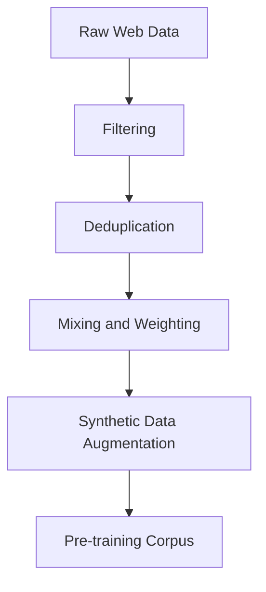
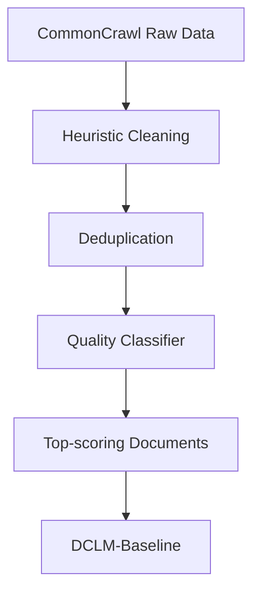
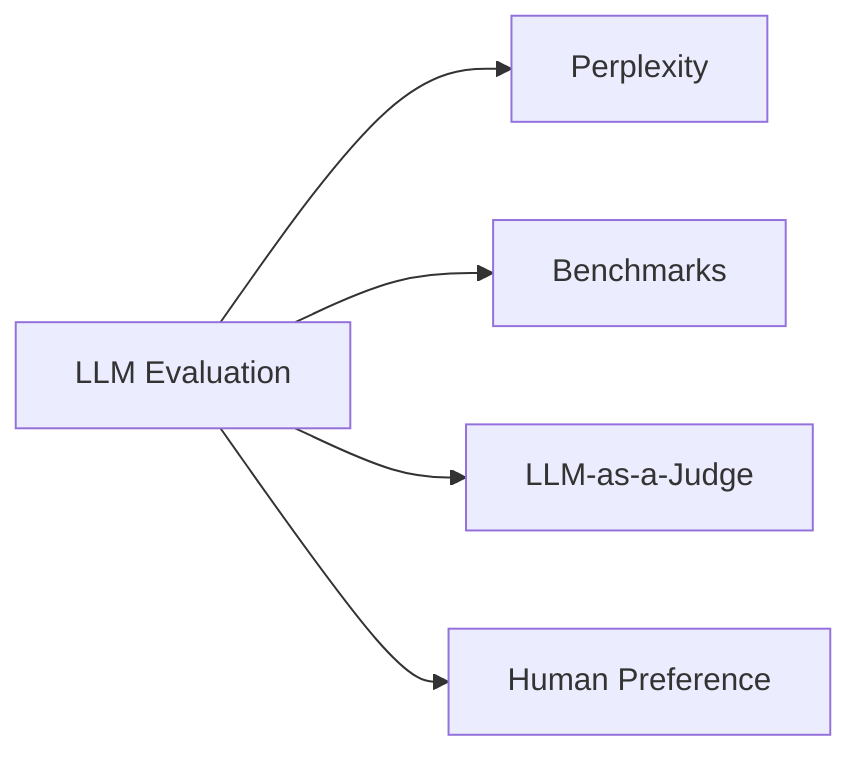



# Pre-training Data for LLMs and Evaluation of LLMs

이번 글은 강의 내용을 다시 풀어 쓰면서, `Pre-training data`가 왜 중요한지와 `LLM evaluation`을 어떻게 읽어야 하는지를 한 흐름으로 정리한 것이다.


## Fundamentals

LLM 학습은 크게 두 단계로 볼 수 있다.

| Stage           | Method                   | Data                                  | Output           |
| --------------- | ------------------------ | ------------------------------------- | ---------------- |
| `Pre-training`  | Next-token prediction    | Massive-scale text corpus             | Base model       |
| `Post-training` | SFT, preference learning | High-quality instruction / comparison | Chat-style model |

이 글에서 핵심은 첫 번째 단계다.  
모델이 어떤 `data`로 학습되었는지가, 이후 모델의 성능과 편향을 상당 부분 결정한다.

> Better model는 더 큰 parameter만으로 만들어지지 않는다.
>
> 같은 compute라도 더 좋은 `pre-training data`를 쓰면 더 좋은 model이 나온다.
{: .prompt-info}

아래 page는 `pre-training`과 `post-training` 을 한눈에 볼 수 있는 정리 페이지다.

<div class="pdf-viewer-container" data-pdf="/assets/img/posts/study-ffm/LLM_Refinement_and_Evaluation.pdf" data-page="2"></div>


## Where Pre-training Data Comes From

대부분의 `pre-training data`는 웹에서 온다.  
대표적으로 `CommonCrawl`이 가장 큰 출발점이다.

`CommonCrawl`은 인터넷을 주기적으로 크롤링해서 공개하는 대규모 저장소다. 많은 open dataset이 사실상 여기서 시작한다. 예를 들어 `LLaMA` 계열 설명에서도 큰 비중이 `CommonCrawl`에서 왔고, 나머지는 `C4`, `GitHub`, `Wikipedia`, `Books`, `ArXiv`, `StackExchange` 같은 소스로 채워진다.

중요한 점은, 대부분의 frontier lab은 실제 학습 데이터를 자세히 공개하지 않는다는 것이다.

- `training data` 자체가 핵심 경쟁력이고
- `copyright` 문제가 매우 민감하기 때문이다

즉, 우리가 공개적으로 볼 수 있는 것은 일부 open dataset과 논문에 정리된 pipeline이고, 실제 상용 모델의 전체 data mix는 잘 보이지 않는다.


## Why Data Curation Matters

웹에서 가져온 원본 text는 그대로 쓰기 어렵다.

- spam이 많고
- advertisement가 많고
- duplicated document가 많고
- 언어 품질이 들쭉날쭉하고
- 의미 없는 boilerplate도 많다

그래서 `data curation`이 필요하다.



보통 핵심 전략은 네 가지로 정리할 수 있다.

| Strategy               | Role                            |
| ---------------------- | ------------------------------- |
| `Filtering`            | 저품질 / 불필요한 text 제거     |
| `Deduplication`        | 반복 문서 제거                  |
| `Mixing and weighting` | source 비중 조절                |
| `Synthetic data`       | 고품질 데이터를 인위적으로 보강 |

여기서 중요한 것은 단순히 "더 많이 모으는 것"이 아니라, "무엇을 남기고 무엇을 버릴지"를 결정하는 것이다.


## Popular Open Datasets

여러 open dataset은 모두 비슷한 재료를 쓰지만, `filtering intensity`와 `quality selection` 방식이 다르다.

| Dataset         | Heuristic Filtering | ML-based Quality Filtering |
| --------------- | ------------------- | -------------------------- |
| `C4`            | Yes                 | No                         |
| `FineWeb`       | Yes                 | No                         |
| `RefinedWeb`    | Yes                 | No                         |
| `Dolma CC`      | Yes                 | Partial                    |
| `DCLM-Baseline` | Yes                 | Yes                        |
| `FineWeb-Edu`   | Yes                 | Yes                        |

### C4

`C4`는 Google이 만든 dataset으로, 비교적 기본적인 heuristic filtering을 사용했다. `T5` 학습에 쓰였고 역사적으로 중요하지만, 지금 기준으로는 filtering이 거친 편이다.

### FineWeb

`FineWeb`은 Hugging Face가 공개한 대규모 web dataset이다. heuristic filtering이 더 정교하고, 공개성과 재현성이 좋다.

### RefinedWeb

`RefinedWeb`은 `deduplication`의 효과를 강하게 보여준 사례다.  
같은 양의 raw data라도 중복 제거를 잘하면 성능이 꽤 좋아질 수 있다.

### DCLM-Baseline

`DCLM-Baseline`은 heuristic cleaning 뒤에 강한 `ML-based quality filtering`을 적용한다. 공개 dataset 중에서는 상당히 강한 baseline으로 자주 언급된다.

### FineWeb-Edu

`FineWeb-Edu`는 교육적으로 가치 있는 문서를 더 남기도록 score를 준 버전이다. 전체 token 수는 줄더라도, `math`나 `science` 같은 task에서는 오히려 더 강할 수 있다.


## Case Study: DCLM-Baseline

강의에서 가장 인상적인 부분 중 하나는 `DCLM-Baseline` pipeline이다.

```text
Raw CommonCrawl
    -> Heuristic cleaning
    -> Deduplication
    -> ML-based quality filtering
    -> Final high-quality corpus
```

좀 더 직관적으로 그리면 아래와 같다.



핵심은 마지막 단계다.  
그냥 규칙으로 거르는 것이 아니라, `quality classifier`를 따로 학습시킨다.

- `positive example`: 좋은 `instruction data`
- `negative example`: 일반적인 web text

그 다음 웹 문서가 얼마나 `high-quality instruction-like data`와 비슷한지 score를 매기고, 상위 일부만 남긴다.

이 접근이 흥미로운 이유는, 단순히 "깨끗한 영어 문장"을 찾는 것이 아니라 "학습에 실제로 도움이 되는 문서"를 찾는 방향으로 넘어가기 때문이다.

> `Filtering`은 쓰레기를 버리는 과정이고,
> `quality filtering`은 좋은 데이터를 적극적으로 고르는 과정이다.
{: .prompt-tip}


## Better Data, Better Model

실험적으로 보면 같은 `FLOPs`를 쓰더라도, 더 좋은 data로 학습한 model이 더 좋은 benchmark 성능을 낸다.

이건 직관적으로도 이해할 수 있다.  
모델은 결국 본 데이터를 압축해서 패턴으로 저장하는데, 입력되는 데이터의 신호 대 잡음비가 높을수록 더 유용한 패턴을 배울 가능성이 크다.

즉, `scaling law`를 볼 때도 parameter나 compute만 보면 안 되고, `data quality`를 같이 봐야 한다.


## Data Mixing Beyond Web Text

최신 model은 웹 text만으로 끝나지 않는다.

- `CommonCrawl` 같은 web corpus
- `GitHub` 같은 code corpus
- `ArXiv`, `Wikipedia`, `Books`
- OCR을 거친 `PDF`
- domain-specific math / science corpus

이렇게 source를 섞는 이유는 각 source가 다른 능력을 보강하기 때문이다.

| Source                   | Strength                        |
| ------------------------ | ------------------------------- |
| `Web text`               | 폭넓은 coverage                 |
| `Code`                   | syntax, structure, tool use     |
| `Academic text`          | dense knowledge, formal style   |
| `Math corpus`            | symbolic pattern                |
| `Books / long-form text` | coherence, narrative continuity |

하지만 어떤 비율이 최적인지는 여전히 open problem이다.  
결국 `data mix`는 model behavior를 설계하는 또 하나의 knob라고 볼 수 있다.


## Dataset Bias Becomes Model Bias

강의의 핵심 메시지는 여기서 더 날카로워진다.  
dataset에는 `bias`가 있고, 그 bias는 model 안으로 들어간다.

### Experiment 1

문장 하나를 보고 그것이 `C4` 출신인지 `FineWeb` 출신인지 구분할 수 있을까?

- Human: `63%`
- GPT: `85.3%`

이 결과는 dataset마다 고유한 `stylistic fingerprint`가 있다는 뜻이다.  
어떤 filtering을 쓰느냐에 따라 남는 글의 스타일이 달라지고, 그 차이는 사람이 느낄 수 있을 정도로 커진다.

### Experiment 2

서로 다른 dataset으로 학습한 model에게 `random token`을 넣고 text를 생성하게 한 뒤, 그 output만 보고 어느 dataset으로 학습했는지 맞출 수 있을까?

결과는 높은 정확도로 가능했다.

이 말은 꽤 강하다.  
편향은 표면적인 데이터 통계에만 머무는 것이 아니라, model의 생성 습관 자체가 된다는 뜻이다.

> Dataset bias는 단순히 input의 문제가 아니라,
> 결국 model behavior의 문제가 된다.
{: .prompt-info}

따라서 benchmark 점수를 볼 때도 조심해야 한다.  
어떤 model이 benchmark에서 높은 점수를 받았다고 해서 정말 더 똑똑한 것일 수도 있지만, 단지 그 benchmark와 비슷한 스타일의 data를 많이 봤을 가능성도 있다.

아래 page는 dataset의 `fingerprint`와 그 bias가 model output으로 이어질 수 있다는 설명과 같이 보면 좋다.

<div class="pdf-viewer-container" data-pdf="/assets/img/posts/study-ffm/LLM_Refinement_and_Evaluation.pdf" data-page="3"></div>


## LLMs Learn Patterns, Not Meaning

강의의 마지막 discussion은 위 내용을 아주 직관적으로 묶어준다.

### Why GPT-2 Could Write Recipes

`GPT-2`는 지금 기준으로 reasoning이 강한 model이 아니다.  
그런데도 recipe를 그럴듯하게 잘 썼다.

이유는 간단하다. 인터넷에는 recipe 형식의 text가 너무 많고, 구조도 매우 일정하기 때문이다.

```text
Ingredients
-> Steps
-> Serving suggestion
```

모델은 이 구조를 반복적으로 학습하면서 pattern을 익힌다.  
즉, 요리를 "이해"했다기보다 recipe의 format을 잘 압축한 것이다.

### Why a Strong Model Can Still Fail Common Sense

반대로 model이 매우 유창해 보여도, 너무 당연한 전제를 놓칠 수 있다.

예를 들어 "세차장이 100m 앞인데 차를 몰고 갈까, 걸어갈까?" 같은 질문에서 model이 "짧은 거리니까 걸어가라"고 답한다면, 이것은 reasoning failure다.

`short distance -> walking is efficient`라는 pattern은 맞을 수 있다.  
하지만 이 상황에는 `car wash에 차를 가져가야 한다`는 더 기본적인 constraint가 있다.

즉, 모델은 종종 실제 세계를 이해해서 답한다기보다, 그럴듯한 text pattern을 이어붙여 답한다.


## Evaluation of LLMs

이제 두 번째 주제로 넘어가자.  
좋은 model을 만들었다면, 그 model을 어떻게 평가해야 할까?

평가는 단순히 leaderboard를 만들기 위한 절차가 아니다.

- 어떤 model을 선택할지 결정해야 하고
- 연구 진전을 측정해야 하고
- architecture나 dataset의 효과를 비교해야 하고
- safety risk도 파악해야 한다

즉, `evaluation`은 연구와 제품 양쪽에서 모두 필수다.


## Four Main Evaluation Paradigms

강의에서는 대표적인 평가 방식을 네 가지로 정리했다.



| Method             | Core Idea                             |
| ------------------ | ------------------------------------- |
| `Perplexity`       | 다음 token을 얼마나 잘 맞추는가       |
| `Benchmark`        | 정답이 있는 task에서 점수를 재는가    |
| `LLM-as-a-judge`   | 다른 model이 output quality를 평가    |
| `Human preference` | 사람이 실제로 어느 답을 더 선호하는가 |

아래 page는 여러 `evaluation method`를 비교해서 볼 때 참고하기 좋은 요약 페이지다.

<div class="pdf-viewer-container" data-pdf="/assets/img/posts/study-ffm/LLM_Refinement_and_Evaluation.pdf" data-page="6"></div>


## Perplexity

`Perplexity`는 language model 평가의 가장 기본적인 수치다.

$$
\mathrm{Perplexity} = \exp\left(-\frac{1}{N}\sum_{i=1}^{N}\log P(t_i)\right)
$$

의미는 단순하다.

- 모델이 다음 token에 높은 확률을 잘 주면 `perplexity`가 낮아지고
- 예측을 못 하면 `perplexity`가 높아진다

장점은 계산이 싸고, token마다 dense signal을 준다는 점이다.  
하지만 한계도 분명하다.

`Perplexity`가 낮다고 해서 reasoning이 좋다는 뜻은 아니다.  
앞에서 본 것처럼 model은 pattern을 잘 맞추는 데는 능숙해도, 실제로 문제를 이해하지 못할 수 있다.


## Benchmark Evaluation

전통적인 `benchmark`는 아래 구조를 따른다.

1. 문제를 제시한다.
2. model이 답을 낸다.
3. 자동으로 정오를 판정한다.
4. 평균 점수를 계산한다.

대표적인 예시는 다음과 같다.

| Benchmark   | What It Tests                      |
| ----------- | ---------------------------------- |
| `HellaSwag` | commonsense completion             |
| `MMLU`      | broad academic knowledge           |
| `GSM8K`     | grade-school math reasoning        |
| `SWE-Bench` | software engineering on real repos |

### HellaSwag

짧은 상황 설명 뒤에 이어질 문장을 고르는 형식이다.  
겉보기에는 쉬워 보여도, 미묘한 `commonsense` 차이를 요구한다.

### MMLU

다양한 분야의 객관식 문제를 모아둔 benchmark다.  
오랫동안 "지식이 얼마나 넓은가"를 보는 대표 지표처럼 쓰였다.

### GSM8K

초등 수준의 `math word problem`이지만, 여러 단계를 거치는 reasoning이 필요하다.

### SWE-Bench

실제 GitHub repository와 issue를 주고 patch를 작성하게 한다.  
정답 여부를 unit test로 판정하기 때문에, agentic coding 능력을 재기 좋다.


## The Task Familiarity Problem

여기서 매우 중요한 caveat가 나온다.  
benchmark score가 높다고 해서 꼭 "더 일반적인 지능"을 뜻하지는 않는다.

왜냐하면 model은 task를 정말 이해해서 잘할 수도 있지만, 단지 그 형식에 익숙해서 잘할 수도 있기 때문이다.

예를 들어,

- 객관식 문제를 많이 본 model
- 수학 풀이 형식을 많이 본 model
- benchmark와 비슷한 style의 데이터를 많이 본 model

은 실제 reasoning improvement 없이도 점수가 크게 올라갈 수 있다.

이건 앞에서 본 `dataset fingerprint`와도 연결된다.  
benchmark는 중립적인 시험지가 아니라, 특정한 style과 format을 가진 데이터 묶음이다.

따라서 benchmark는 유용하지만, 절대적인 척도로 읽으면 위험하다.


## Evaluating Open-ended Outputs

모든 task에 정답이 하나씩 있는 것은 아니다.  
예를 들어 `summarization`, `legal writing`, `creative writing` 같은 task는 여러 답이 가능하다.

이럴 때 주로 두 가지 방법을 쓴다.

### LLM-as-a-judge

다른 LLM이 output을 보고 점수를 매기는 방식이다.

- scalable하고
- 자동화하기 쉽고
- open-ended task에 잘 맞는다

하지만 judge model이 약하면 좋은 답과 나쁜 답을 안정적으로 구분하지 못할 수 있다.

### Rubric-based Evaluation

평가 기준을 여러 항목으로 쪼개서 본다.

예를 들면:

- 핵심 issue를 언급했는가
- evidence를 포함했는가
- 사실 오류가 없는가

이 방식은 더 투명하지만, rubric 바깥의 좋은 답을 놓칠 수 있다.


## Human Preference

결국 실제 사용성에 가장 가까운 것은 사람의 선택이다.

대표적인 예가 `Chatbot Arena` 방식이다.

- 같은 prompt에 대해 두 model의 답을 나란히 보여주고
- 사용자가 더 좋은 답을 고르고
- pairwise comparison으로 rating을 계산한다

이 방식의 장점은 실제 user experience와 가깝다는 것이다.  
반대로 단점은 느리고 비싸며, 통제가 어렵다는 점이다.


## Limits of Evaluation

어떤 평가 방식을 쓰든 반복해서 등장하는 한계가 있다.

| Limitation         | Meaning                                         |
| ------------------ | ----------------------------------------------- |
| `Contamination`    | benchmark 문항이 training data에 섞였을 수 있음 |
| `Task familiarity` | 형식에 익숙해서 점수가 오를 수 있음             |
| `Relative score`   | 점수는 상대 비교이지 절대 능력 수치가 아님      |

즉, `70% on MMLU` 같은 숫자는 그 자체로 model의 지능을 정의하지 않는다.  
그 숫자는 특정 benchmark, 특정 protocol, 특정 시점에서의 상대적 결과일 뿐이다.


## Final Takeaway

이번 강의의 핵심은 두 문장으로 요약할 수 있다.

> LLM은 결국 data로부터 pattern을 배운다.
>
> 그리고 evaluation은 그 pattern의 능력을 부분적으로만 측정한다.
{: .prompt-info}

조금 더 풀어서 쓰면 다음과 같다.

| Topic               | Takeaway                                        |
| ------------------- | ----------------------------------------------- |
| `Pre-training data` | web-scale raw data보다 curated data가 중요하다  |
| `Dataset bias`      | filtering choice가 dataset fingerprint를 만든다 |
| `Model behavior`    | dataset bias는 model bias로 이어진다            |
| `Evaluation`        | benchmark는 필요하지만 절대적인 잣대는 아니다   |
| `LLM capability`    | fluency와 real understanding은 다르다           |

결국 좋은 LLM을 이해하려면 세 가지를 함께 봐야 한다.

1. 어떤 `data`로 학습했는가
2. 어떤 `objective`와 `pipeline`을 썼는가
3. 어떤 `evaluation`으로 무엇을 측정했는가

이 셋을 같이 보지 않으면, model의 진짜 성격을 놓치기 쉽다.
